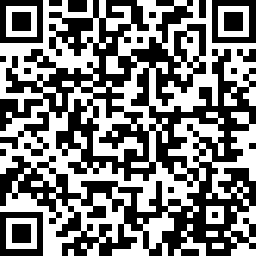

# infoshare 2018 - Twoja pierwsza aplikacja w Python - drugi termin

warsztat odbędzie się w dniu **21 maj 2018 (poniedziałek), w godzinach 13:30 - 17:00.**  
Szczegóły na stronie: <https://infoshare.pl/is-register/#item-15>

## O warsztacie

Python, ze względu na prostą składnię, jest doskonałym językiem do nauki programowania. Jego uniwersalność sprawia, że znajduje zastosowanie w wielu obszarach: tworzeniu stron internetowych, analizie danych, czy sztucznej inteligencji.

## Pre-work

Aby zostać zakwalifikowanym do udziału w warsztacie należy wykonać samodzielnie poniższe zadania.

1. Przygotuj swój komputer do pracy z Python'em (możesz wspomóc się filmikiem <https://youtu.be/YYXdXT2l-Gg>):
    * zainstaluj Python co najmniej w wersji 3.6 - <https://www.python.org/downloads/release/python-365/>  
    **UWAGA przy instalacji na systemach Windows!** - należy zaznaczyć opcję '**Add Python to environment variables**' oraz/lub '**Add Python to PATH**'
    * zainstaluj jeden z poniższych edytorów tekstu (służą do pisania kodu, możesz wypróbować wszystkie i używać ten, który najbardziej będzie Tobie odpowiadać):
        * [PyCharm Community](https://www.jetbrains.com/pycharm/download/)
        * [Visual Studio Code](https://code.visualstudio.com/)
        * [Atom](https://atom.io/)
        * [Sublime Text](https://www.sublimetext.com/)

2. wykonaj samodzielnie ćwiczenia zaprezentowane w poniższych filmikach (filmy po angielsku!):
    * praca z tekstem - <https://youtu.be/k9TUPpGqYTo>
    * liczby całkowite i zmiennoprzecinkowe - <https://youtu.be/khKv-8q7YmY>
    * listy oraz zbiory danych - <https://youtu.be/W8KRzm-HUcc>
    * słowniki (klucz-wartość) - <https://youtu.be/daefaLgNkw0>
    * instrukcje warunkowe - <https://youtu.be/DZwmZ8Usvnk>
    * pętle - <https://youtu.be/6iF8Xb7Z3wQ>
    * definiowanie funkcji - <https://youtu.be/9Os0o3wzS_I>

3. odpowiedz na pytania zamieszczone w krótim teście (10 pytań) - link znajduje się poniżej.

    **UWAGA!**  
    * **Test możesz wypełnić tylko raz!**
    * Zmieniać swoje odpowiedzi możesz do momentu zaakceptowania całego testu
    * Po wysłaniu testu, zmiana odpowiedzi nie będzie możliwa
    * Wypełnienie testu nie gwarantuje udziału w warsztacie
    * Osoby zakwalifikowane do udziału w warsztacie zostaną o tym poinformowane
    * Osoby zakwalifikowane muszą potwierdzić udział w warsztacie!!!
    * Data zakończenia testu to godzina 23:59 w dniu **15 maja 2018**.
    * **Zastrzegamy sobie prawo do wcześniejszego zamknięcia testu**

## Test

Jeśli jesteś gotowa/y, przejdź na stronę testu klikając na poniższy odnośnik, lub skanując kod QR.

### Link do testu

[**Test kwalifikacyjny na warsztat - https://www.surveymonkey.com/r/VMVMCJY**](https://www.surveymonkey.com/r/VMVMCJY)

### Kod QR do testu

